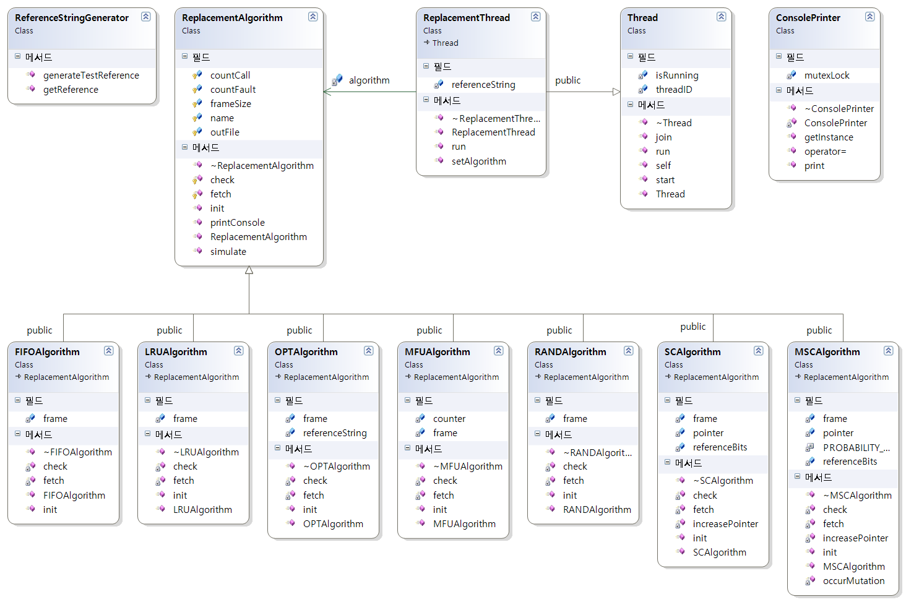
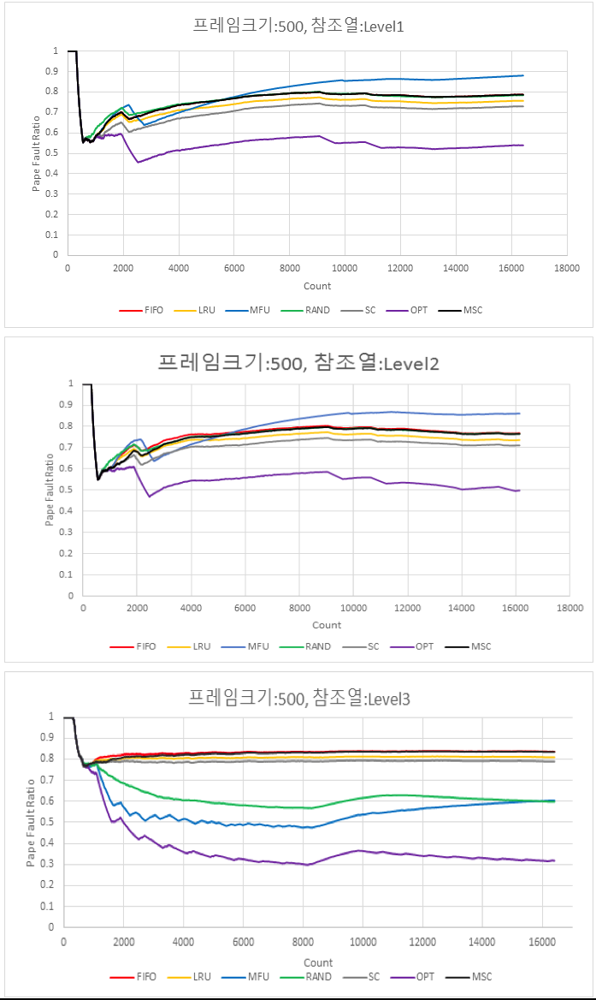
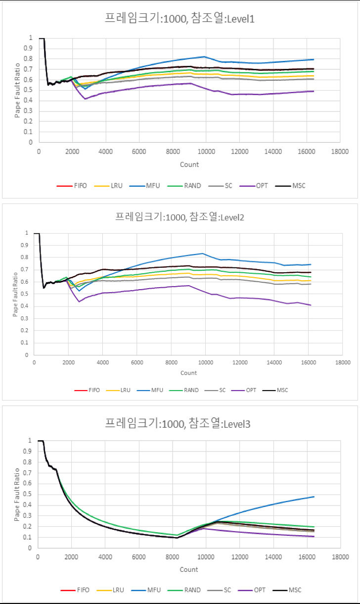
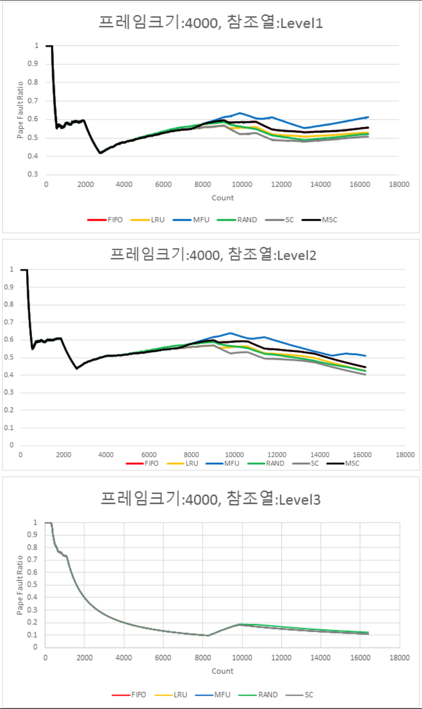

# Page Replacement Simulation

c++로 작성된 페이지 교체 시뮬레이션입니다.

## 프로젝트 설명

- 팀구성: 설계1, 개발4, 테스트 케이스 구성2
- 운영체제 페이지 교체 알고리즘별 성능 비교를 위한 시뮬레이션 프로그램
  - 팀의 리더로서 프로젝트 진행
  - 디자인 패턴을 활용한 객체지향 디자인 설계 및 개발
  - 참고문헌을 활용한 테스트 케이스 구성
  
## 기술요소

1. C++
2. Operating System
3. Design Pattern

## 클래스 다이어그램

### 사용패턴

1. Strategy Pattern
2. Template Method Pattern
3. Singleton Pattern

## 실험 결과

### 참조열의 구성

Locality에 따라 총 3가지 단계(level1~3)의 참조열 구성

level이 높을수록 참조열의 Locality가 높음

### Frame Size 500

### Frame Size 1000

### Frame Size 2000

### Frame Size 4000

